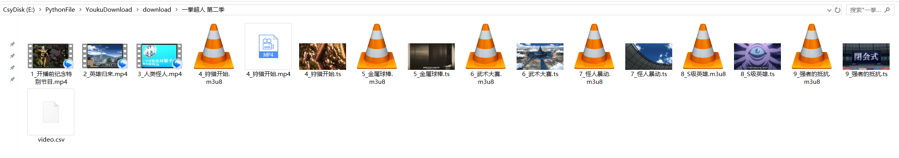

# YoukuDownload

#### 介绍
优酷视频下载

#### 实现思路
使用selenium模拟用户登录和观看视频，捕获.m3u8(视频文件)、.ass(字幕文件)。最后将.m3u8下载转换为.ts文件，使用ffmpeg进行.ts文件和.ass字幕文件整合

#### 使用说明
首先输入优酷的vip账号，重命名 youkuAccount.demo.py 为 youkuAccount.py，将优酷账号密码填入对应的位置

##### 抓取视频合集
<pre>py main.py</pre>

或者 py main.py "分组名" "视频地址"
例如
<pre>py main.py "一拳超人 第二季" "https://v.youku.com/v_show/id_XNDEyMjM2MTgzNg==.html"</pre>

